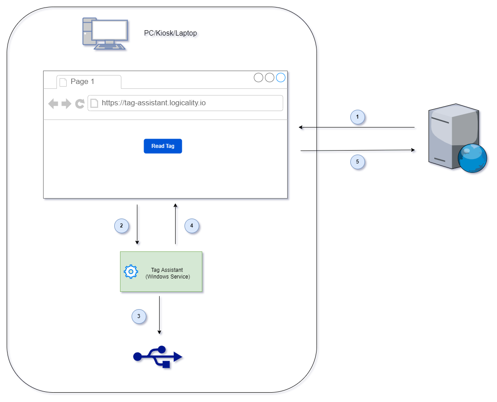

<!-- omit in toc -->
# 1. Tag Assistant

- [Introduction](#introduction)
- [Technical Requirements](#technical-requirements)
- [Installation Guide](#installation-guide)
- [Configuration](#configuration)
  - [Manual Configuration.](#manual-configuration)
  - [Scripted installation.](#scripted-installation)
- [Contact](#contact)

## Introduction

Logicality Tag Assistant is a desktop Windows service that bridges reading NFC and IButton devices to authorized web applications. Integration with a web application is entirely through JavaScript in the browser - there are no backend services required.



1. Supporting web applications included some use some simple JavaScript to enable the browser client communicate with Tag Assistant.
2. The script makes an HTTP call to `http://localhost:37888` to read the unique ID of tag.
3. Tag Assistant then queries connected USB devices to see if there are any tags presnt.
4. If a Tag is present, Tag Assistant will return the unique ID of the tag back to the browser.
5. The browser can then use that ID to peform an identity lookup for the user who is assigned the tag and any other processing.

## Technical Requirements

- All up-to-date major browsers on Windows (Chrome, Edge and Firefox) are supported.
- Currently tested with Windows 10 & 11, 64bit. If another operating system version or 32bit is desired, please contact us.
- Low system requirements - the service typically consumes less than 50MB RAM and 0% CPU when idle.
- Allow the handling of incoming HTTP requests on `localhost:37888` adjusting any firewall rules as necessary.

Currently supported devices:

1. iButton reader using [DS9490R USB Adapter](https://www.maximintegrated.com/en/products/ibutton-one-wire/ibutton/DS9490R.html).
2. NFC/RFID Tags using [ACS ACR122U USB NFC](https://www.acs.com.hk/en/products/3/acr122u-usb-nfc-reader/). Other similar devices that support the same standards will likely work. Contact us to verify.

If you would like to see support of additional devices, smart card readers etc., please contact us.

## Installation Guide

Download and install drivers for the devices you wish to use:

- [iButton One Wire Drivers](https://www.maximintegrated.com/en/products/ibutton-one-wire/one-wire/software-tools/drivers/download-1-wire-ibutton-drivers-for-windows.html). Supported driver version is `v405`, 64 bit.
- [ACS ACR122U USB NFC drivers](https://www.acs.com.hk/en/products/3/acr122u-usb-nfc-reader/).

Downloads are available in two formats:

- An MSI that installs a Windows Service. You will need the appropriate rights to perform the installation.
- A standalone console application. Useful for trying out on a restricted system and/or for development purposes.
  
1. Download the latest `.msi.zip` release from https://github.com/logicality-io/tag-assistant-support/releases
2. Extract the `msi` installer from the zip file.
3. Run the `msi` program and follow the on-screen instructions.
   1.  During installation you may see a windows warning: "Windows protected your PC. Microsoft Defender SmartScreen prevented...".  The reason for this is that the package is not yet digitally signed. This will be addressed in a future version. Click `More Info` followed by `Run anyway` to proceed with installation.
   2.  If during installation you will see a windows warning, "Do you want to allow this app from an unknown publisher to make changes to your device?". The reason for this is that the package is not yet digitally signed. This will be addressed in a future version. Click "Proceed" to continue.
4. After installation browse to http://localhost:37888 to view the embedded Administation UI, diagnostics, configuration and to test your installation.
5. Additionally, go to https://tag-assistant.logicality.io to test your installation with a remote web application.

Notes:
1. By default, Tag Assistant will install into `%ProgramFiles%\Logicality\Tag Assistant`.
2. Tag Assistant stores data (configuration and logs) in `%ProgramData%\Logicality\Tag Assistant\`

## Configuration

Leveraging [CORS](https://en.wikipedia.org/wiki/Cross-origin_resource_sharing) for authorization purposes, Tag Assistant will only respond to HTTP requests from [Origin(s)](https://developer.mozilla.org/en-US/docs/Web/HTTP/Headers/Origin) that you explicitly allow. This will prevent an attacker from tricking a user into presenting their tag and having it's identity exfiltrated from an unauthorized web application.

Tag Assistant supports two mechanism of configuration:

1. Manual configuration through the embedded administration UI and stored in the data.
2. Scripted installation with configuration stored in the installation directory.

### Manual Configuration.

After running the software for the first time, if no Allowed CORS Origns configuration is found, an `origins.json` template file is written to
`%ProgramData%\Logicality\Tag Assistant\origins.json`. It looks similar to this:

```json
{
  "allowedCorsOrigins": [
    "https://tag-assistant.logicality.io"
  ]
}
```

From the embedded Administraion UI you can add/remove desired origins, or manually edit this file. Changes will require
a service restart.

Add the origin of the application that integrates with Tag Assistant to this list. For example, if your applcation is hosted
at `https://company.internal/myapp` the origin entry will be `https://company.internal`. Restart the service / console application 
after making any changes. 

### Scripted installation.

Many enterprise will re-package `.msi` installers for their own needs. If that option is chosen, an `origins.json` file can 
be packed and stored in the installation directory. Tag Assistant will use this configuration regardless of whether an `origins.json`
file exists in the data directory or not. Configuration through the embedded Administration UI will be disabled.

## Contact

For licencing, sales and other enquiries, please email contact@logicality.io.
